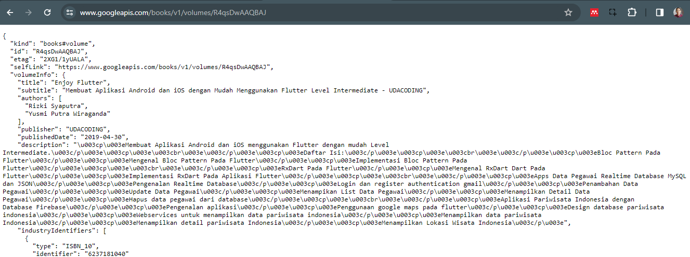
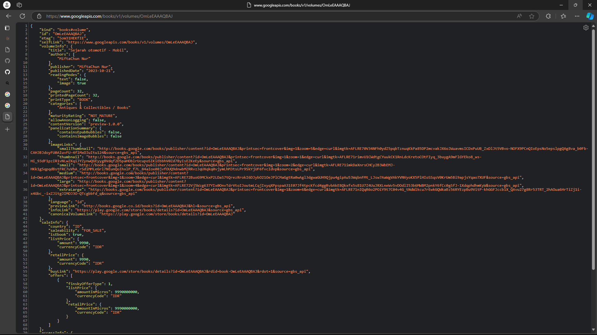
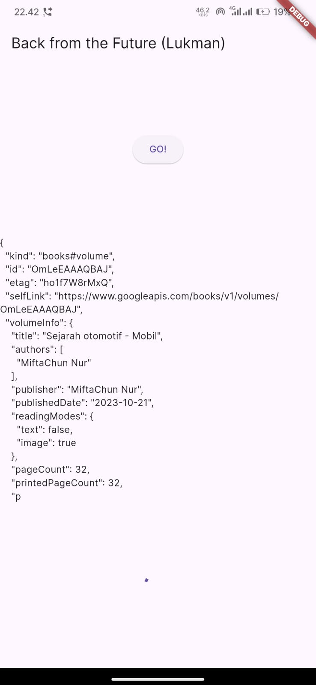
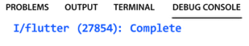

# Nama  : Lukman Eka Septiawan
# Kelas : TI-3C

## Praktikum 1: Mengunduh Data dari Web Service (API)

### Langkah 1: Buat Project Baru
    Buatlah sebuah project flutter baru dengan nama books di folder src week-12 repository GitHub Anda.

    Kemudian Tambahkan dependensi http dengan mengetik perintah berikut di terminal.

```dart
flutter pub add http
```

### Langkah 2: Cek file pubspec.yaml
    Jika berhasil install plugin, pastikan plugin http telah ada di file pubspec ini seperti berikut.

```dart
dependencies:
  flutter:
    sdk: flutter
  http: ^1.1.0
```

### Langkah 3: Buka file main.dart
> 1. Task
> - Tambahkan nama panggilan Anda pada **title** app sebagai identitas hasil pekerjaan Anda.

```dart
import 'dart:async';
import 'package:flutter/material.dart';
import 'package:http/http.dart';
import 'package:http/http.dart' as http;

void main() {
  runApp(const MyApp());
}

class MyApp extends StatelessWidget {
  const MyApp({super.key});

  @override
  Widget build(BuildContext context) {
    return MaterialApp(
      title: 'Flutter Demo',
      theme: ThemeData(
        primarySwatch: Colors.blue,
        visualDensity: VisualDensity.adaptivePlatformDensity,
      ),
      home: const FuturePage(),
    );
  }
}

class FuturePage extends StatefulWidget {
  const FuturePage({super.key});

  @override
  State<FuturePage> createState() => _FuturePageState();
}

class _FuturePageState extends State<FuturePage> {
  String result = '';

  Future<Response> getData() async {
    const authority = 'www.googleapis.com';
    const path = '/books/v1/volumes/OmLeEAAAQBAJ';
    Uri url = Uri.https(authority, path);
    return http.get(url);
  }

  @override
  Widget build(BuildContext context) {
    return Scaffold(
      appBar: AppBar(
        title: const Text('Back from the Future (Lukman)'),
      ),
      body: Center(
        child: Column(
          children: [
            const Spacer(),
            ElevatedButton(
              child: const Text('GO!'),
              onPressed: () {
                setState(() {});
                getData().then((value) {
                  result = value.body.toString().substring(0, 450);
                  setState(() {});
                }).catchError((_) {
                  result = 'An error occurred';
                  setState(() {});
                });
              },
            ),
            const Spacer(),
            Text(result),
            const Spacer(),
            const CircularProgressIndicator(),
            const Spacer(),
          ],
        ),
      ),
    );
  }
}
```
    Catatan: 
    Tidak ada yang spesial dengan kode di main.dart tersebut. Perlu diperhatikan di kode tersebut terdapat widget CircularProgressIndicator yang akan menampilkan animasi berputar secara terus-menerus, itu pertanda bagus bahwa aplikasi Anda responsif (tidak freeze/lag). Ketika animasi terlihat berhenti, itu berarti UI menunggu proses lain sampai selesai.

### Langkah 4: Tambah method getData()
    Tambahkan method ini ke dalam class _FuturePageState yang berguna untuk mengambil data dari API Google Books.

```dart

```

> 2. Task
> - Carilah judul buku favorit Anda di Google Books, lalu ganti ID buku pada variabel path di kode tersebut. Caranya ambil di URL browser Anda seperti gambar berikut ini.

> - Kemudian cobalah akses di browser URI tersebut dengan lengkap seperti ini. Jika menampilkan data JSON, maka Anda telah berhasil. Lakukan capture milik Anda dan tulis di README pada laporan praktikum. Lalu lakukan commit dengan pesan "W12: Soal 2".



### Langkah 5: Tambah kode di ElevatedButton
    Tambahkan kode pada onPressed di ElevatedButton seperti berikut.

```dart
ElevatedButton(
    child: const Text('GO!'),
    onPressed: () {
    setState(() {});
    getData().then((value) {
        result = value.body.toString().substring(0, 450);
        setState(() {});
    }).catchError((_) {
        result = 'An error occurred';
        setState(() {});
    });
    },
),
```

> 3. Task
> - Jelaskan maksud kode langkah 5 tersebut terkait substring dan catchError!
>
>   substring digunakan untuk menampilkan karakter sesuai dengan parameter yang dikirimkan. pada contoh di atas menggunakan substring(0, 450) dimana nilai string akan ditampilkan mulai dari karakter pertama (0) hingga karakter terakhir (450). Sedangkan untuk catchError digunakan untuk menangani kesalahan yang mungkin terjadi saat program sedang berjalan.
>
> - Capture hasil praktikum Anda berupa GIF dan lampirkan di README. Lalu lakukan commit dengan pesan "W12: Soal 3".


## Praktikum 2: Menggunakan await/async untuk menghindari callbacks
Ada alternatif penggunaan Future yang lebih clean, mudah dibaca dan dirawat, yaitu pola async/await. Intinya pada dua kata kunci ini:

-  async digunakan untuk menandai suatu method sebagai asynchronous dan itu harus ditambahkan di depan kode function.

-  await digunakan untuk memerintahkan menunggu sampai eksekusi suatu function itu selesai dan mengembalikan sebuah value. Untuk then bisa digunakan pada jenis method apapun, sedangkan await hanya bekerja di dalam method async.
 
### Langkah 1: Buka file main.dart
    Tambahkan tiga method berisi kode seperti berikut di dalam class _FuturePageState.

```dart
class _FuturePageState extends State<FuturePage> {
  String result = '';

  Future<Response> getData() async {
    const authority = 'www.googleapis.com';
    const path = '/books/v1/volumes/OmLeEAAAQBAJ';
    Uri url = Uri.https(authority, path);
    return http.get(url);
  }

  Future<int> returnOneAsync() async {
    await Future.delayed(const Duration(seconds: 3));
    return 1;
  }
  
  Future<int> returnTwoAsync() async {
    await Future.delayed(const Duration(seconds: 3));
    return 2;
  }
  
  Future<int> returnThreeAsync() async {
    await Future.delayed(const Duration(seconds: 3));
    return 3;
  }
```

### Langkah 2: Tambah method count()
    Lalu tambahkan lagi method ini di bawah ketiga method sebelumnya.

```dart
Future count() async {
  int total = 0;
  total = await returnOneAsync();
  total += await returnTwoAsync();
  total += await returnThreeAsync();
  setState(() {
    result = total.toString();
  });
}
```

### Langkah 3: 
    Lakukan comment kode sebelumnya, ubah isi kode onPressed() menjadi seperti berikut.

```dart
ElevatedButton(
    child: const Text('GO!'),
    onPressed: () {
    // setState(() {});
    // getData().then((value) {
    //   result = value.body.toString().substring(0, 450);
    //   setState(() {});
    // }).catchError((_) {
    //   result = 'An error occurred';
    //   setState(() {});
    // });

    count();
    },
),
```

### Langkah 4: 
    Akhirnya, run atau tekan F5 jika aplikasi belum running. Maka Anda akan melihat seperti gambar berikut, hasil angka 6 akan tampil setelah delay 9 detik.


> 4. Task
> - Jelaskan maksud kode langkah 1 dan 2 tersebut!
>
>   Pada langkah 1 kita menambahkan 3 method yang digunakan untuk menambahkan waktu tunggu selama 3 detik per method (total 9 detik) dan ketiga method tersebut mengembalikan nilai mereka masing-masing. Pada langkah 2 kita menambahkan metod count() untuk menjumlahkan nilai yang dikirimkan oleh 3 method sebelumnya.
>
> - Capture hasil praktikum Anda berupa GIF dan lampirkan di README. Lalu lakukan commit dengan pesan "W12: Soal 4".


## Praktikum 3: Menggunakan Completer di Future
Menggunakan Future dengan then, catchError, async, dan await mungkin sudah cukup untuk banyak kasus, tetapi ada alternatif melakukan operasi async di Dart dan Flutter yaitu dengan class Completer.

Completer membuat object Future yang mana Anda dapat menyelesaikannya nanti (late) dengan return sebuah value atau error.

### Langkah 1: Buka main.dart
    Pastikan telah impor package async berikut.

```dart
import 'package:async/async.dart';
```

### Langkah 2: Tambahkan variabel dan method
    Tambahkan variabel late dan method di class _FuturePageState seperti ini.

```dart
class _FuturePageState extends State<FuturePage> {
  String result = '';
  late Completer completer;

  Future getNumber() {
    completer = Completer<int>();
    calculate();
    return completer.future;
  }

  Future calculate() async {
    await Future.delayed(const Duration(seconds: 5));
    completer.complete(42);
  }
```

### Langkah 3: Ganti isi kode onPressed()
    Tambahkan kode berikut pada fungsi onPressed(). Kode sebelumnya bisa Anda comment.

```dart
ElevatedButton(
    child: const Text('GO!'),
    onPressed: () {
    // setState(() {});
    // getData().then((value) {
    //   result = value.body.toString().substring(0, 450);
    //   setState(() {});
    // }).catchError((_) {
    //   result = 'An error occurred';
    //   setState(() {});
    // });

    // count();

    getNumber().then((value) {
        setState(() {
        result = value.toString();
        });
    });
    },
),
```

### Langkah 4: Run Project
    Terakhir, run atau tekan F5 untuk melihat hasilnya jika memang belum running. Bisa juga lakukan hot restart jika aplikasi sudah running. Maka hasilnya akan seperti gambar berikut ini. Setelah 5 detik, maka angka 42 akan tampil.


> 5. Task
> - Jelaskan maksud kode langkah 2 tersebut!
>
>   Pada langkah 2 kita menambahkan 2 method baru pada main.dart. method pertama digunakan untuk mendapatkan angka, sedangkan completer digunakan untuk menyelesaikan method dengan waktu yang sudah ditentukan. Sedangkan method kedua digunakan untuk memberikan/mengirimkan angka saat method ini dipanggul/digunakan.
>
> - Capture hasil praktikum Anda berupa GIF dan lampirkan di README. Lalu lakukan commit dengan pesan "W12: Soal 5".


### Langkah 5: Ganti method calculate()
    Gantilah isi code method calculate() seperti kode berikut, atau Anda dapat membuat calculate2()

```dart
Future calculate() async {
  try {
    await Future.delayed(const Duration(seconds: 5));
    completer.complete(42);
  } catch (_) {
    completer.completeError({}); 
  }
}
```

### Langkah 6: Pindah ke onPressed()
    Ganti menjadi kode seperti berikut.

```dart
ElevatedButton(
    child: const Text('GO!'),
    onPressed: () {
    // setState(() {});
    // getData().then((value) {
    //   result = value.body.toString().substring(0, 450);
    //   setState(() {});
    // }).catchError((_) {
    //   result = 'An error occurred';
    //   setState(() {});
    // });

    // count();

    getNumber().then((value) {
        setState(() {
        result = value.toString();
        });
    }).catchError((e) {
        result = 'An error occurred';
    });
    },
),
```

> 6. Task
> - Jelaskan maksud perbedaan kode langkah 2 dengan langkah 5-6 tersebut!
>
>   Pada langkah 5 kita membungkus kode yang sudah kita buat sebelumnya pada langkah 2 menggunakan try-catch. Penggunaan try-catch ini berfungsi untuk menghandle error yang muncul saat program sedang berjalan. Sedangkan langkah 6 memiliki fungsi yang hampir sama dengan langkah 5, tetapi pada langkah ini berguna untuk menghandle error saat button ditekan.
>
> - Capture hasil praktikum Anda berupa GIF dan lampirkan di README. Lalu lakukan commit dengan pesan "W12: Soal 6"
<!-- task 5 and 6 have the same view -->


## Praktikum 4: Memanggil Future secara paralel
Ketika Anda membutuhkan untuk menjalankan banyak Future secara bersamaan, ada sebuah class yang dapat Anda gunakan yaitu: FutureGroup.

FutureGroup tersedia di package async, yang mana itu harus diimpor ke file dart Anda, seperti berikut.

```dart
import 'package:async/async.dart';
```

> **Catatan**:  Package dart:async dan async/async.dart merupakan library yang berbeda. Pada beberapa kasus, Anda membutuhkan kedua lib tersebut untuk me-run code async.

FutureGroup adalah sekumpulan dari Future yang dapat run secara paralel. Ketika run secara paralel, maka konsumsi waktu menjadi lebih hemat (cepat) dibanding run method async secara single setelah itu method async lainnya.

Ketika semua code async paralel selesai dieksekusi, maka FutureGroup akan return value sebagai sebuah List, sama juga ketika ingin menambahkan operasi paralel dalam bentuk List.

### Langkah 1: Buka file main.dart
    Tambahkan method ini ke dalam class _FuturePageState

```dart

```

### Langkah 2: Edit onPressed()
    Anda bisa hapus atau comment kode sebelumnya, kemudian panggil method dari langkah 1 tersebut.

```dart

```

### Langkah 3: Run Project
    Anda akan melihat hasilnya dalam 3 detik berupa angka 6 lebih cepat dibandingkan praktikum sebelumnya menunggu sampai 9 detik.

> 7. Task
> - Capture hasil praktikum Anda berupa GIF dan lampirkan di README. Lalu lakukan commit dengan pesan "W12: Soal 7".

### Langkah 4: Ganti variabel futureGroup
    Anda dapat menggunakan FutureGroup dengan Future.wait seperti kode berikut.

```dart
final futures = Future.wait<int>([
  returnOneAsync(),
  returnTwoAsync(),
  returnThreeAsync(),
]);
```

> 8. Task
> - Jelaskan maksud perbedaan kode langkah 1 dan 4!

## Praktikum 5: Menangani Respon Error pada Async Code
Ada beberapa teknik untuk melakukan handle error pada code async. Pada praktikum ini Anda akan menggunakan 2 cara, yaitu then() callback dan pola async/await.

### Langkah 1: Buka file main.dart
    Tambahkan method ini ke dalam class _FuturePageState

```dart

```

### Langkah 2: ElevatedButton
    Ganti dengan kode berikut

```dart

```

### Langkah 3: Run Project
    Lakukan run dan klik tombol GO! maka akan menghasilkan seperti gambar berikut.


    Pada bagian debug console akan melihat teks Complete seperti berikut.



> 9. Task
> - Capture hasil praktikum Anda berupa GIF dan lampirkan di README. Lalu lakukan commit dengan pesan "W12: Soal 9".

### Langkah 4: Tambah method handleError()
    Tambahkan kode ini di dalam class _FutureStatePage

```dart

```

> 10. Task
> - Panggil method handleError() tersebut di ElevatedButton, lalu run. Apa hasilnya? Jelaskan perbedaan kode langkah 1 dan 4!

## Praktikum 6: Menggunakan Future dengan StatefulWidget
Seperti yang Anda telah pelajari, Stateless widget tidak dapat menyimpan informasi (state), StatefulWidget dapat mengelola variabel dan properti dengan method setState(), yang kemudian dapat ditampilkan pada UI. State adalah informasi yang dapat berubah selama life cycle widget itu berlangsung.

Ada **4 method utama** dalam life cycle StatefullWidget:

- initState(): dipanggil sekali ketika state dibangun. Bisa dikatakan ini juga sebagai konstruktor class.
- build(): dipanggil setiap kali ada perubahan state atau UI. Method ini melakukan destroy UI dan membangun ulang dari nol.
- deactive() dan dispose(): digunakan untuk menghapus widget dari tree, pada beberapa kasus dimanfaatkan untuk menutup koneksi ke database atau menyimpan data sebelum berpindah screen.

### Langkah 1: Install plugin geolocator
    Tambahkan plugin geolocator dengan mengetik perintah berikut di terminal.

```dart
flutter pub add geolocator
```

### Langkah 2: Tambah permission GPS
    Jika Anda menargetkan untuk platform Android, maka tambahkan baris kode berikut di file android/app/src/main/androidmanifest.xml

```dart
<uses-permission android:name="android.permission.ACCESS_FINE_LOCATION"/>
<uses-permission android:name="android.permission.ACCESS_COARSE_LOCATION"/>
```

    Jika Anda menargetkan untuk platform iOS, maka tambahkan kode ini ke file Info.plist

```dart
<key>NSLocationWhenInUseUsageDescription</key>
<string>This app needs to access your location</string>
```

### Langkah 3: Buat file geolocation.dart
    Tambahkan file baru ini di folder lib project Anda.

```dart

```

### Langkah 4: Buat StatefulWidget
    Buat class LocationScreen di dalam file geolocation.dart

```dart

```

### Langkah 5: Isi kode geolocation.dart
```dart

```

> 11. Task
> - Tambahkan nama panggilan Anda pada tiap properti title sebagai identitas pekerjaan Anda.

### Langkah 6: Edit main.dart
    Panggil screen baru tersebut di file main Anda seperti berikut.

```dart
home: LocationScreen(),
```

### Langkah 7: Run Project
    Run project Anda di device atau emulator (bukan browser), maka akan tampil seperti berikut ini.


### Langkah 8: Tambahkan animasi loading
    Tambahkan widget loading seperti kode berikut. Lalu hot restart, perhatikan perubahannya.

```dart

```

> 12. Task
> - Jika Anda tidak melihat animasi loading tampil, kemungkinan itu berjalan sangat cepat. Tambahkan delay pada method getPosition() dengan kode await Future.delayed(const Duration(seconds: 3));
> - Apakah Anda mendapatkan koordinat GPS ketika run di browser? Mengapa demikian?
> - Capture hasil praktikum Anda berupa GIF dan lampirkan di README. Lalu lakukan commit dengan pesan "W12: Soal 12".

## Praktikum 7: Manajemen Future dengan FutureBuilder
Pola ketika menerima beberapa data secara async dan melakukan update pada UI sebenarnya itu tergantung pada ketersediaan data. Secara umum fakta di Flutter, ada sebuah widget yang membantu Anda untuk memudahkan manajemen future yaitu widget FutureBuilder.

Anda dapat menggunakan FutureBuilder untuk manajemen future bersamaan dengan update UI ketika ada update Future. FutureBuilder memiliki status future sendiri, sehingga Anda dapat mengabaikan penggunaan setState, Flutter akan membangun ulang bagian UI ketika update itu dibutuhkan.

### Langkah 1: Modifikasi method getPosition()
    Buka file geolocation.dart kemudian ganti isi method dengan kode ini.

```dart

```

### Langkah 2: Tambah variabel
    Tambah variabel ini di class _LocationScreenState

```dart

```

### Langkah 3: Tambah initState()
    Tambah method ini dan set variabel position

```dart

```

### Langkah 4: Edit method build()
    Ketik kode berikut dan sesuaikan. Kode lama bisa Anda comment atau hapus.

```dart

```

> 13. Task 
> - Apakah ada perbedaan UI dengan praktikum sebelumnya? Mengapa demikian?
> - Capture hasil praktikum Anda berupa GIF dan lampirkan di README. Lalu lakukan commit dengan pesan "W12: Soal 13".
> - Seperti yang Anda lihat, menggunakan FutureBuilder lebih efisien, clean, dan reactive dengan Future bersama UI.

### Langkah 5: Tambah handling error
    Tambahkan kode berikut untuk menangani ketika terjadi error. Kemudian hot restart.

```dart
else if (snapshot.connectionState == ConnectionState.done) {
  if (snapshot.hasError) {
     return Text('Something terrible happened!');
  }
  return Text(snapshot.data.toString());
}
```

> 14. Task
> - Apakah ada perbedaan UI dengan langkah sebelumnya? Mengapa demikian?
> - Capture hasil praktikum Anda berupa GIF dan lampirkan di README. Lalu lakukan commit dengan pesan "W12: Soal 14".

## Praktikum 8: Navigation route dengan Future Function
Praktikum kali ini Anda akan melihat manfaat Future untuk Navigator dalam transformasi Route menjadi sebuah function async. Anda akan melakukan push screen baru dan fungsi await menunggu data untuk melakukan update warna background pada screen.

### Langkah 1: Buat file baru navigation_first.dart
    Buatlah file baru ini di project lib Anda.
```dart

```

### Langkah 2: Isi kode navigation_first.dart
```dart

```

> 15. Task
> - Tambahkan nama panggilan Anda pada tiap properti title sebagai identitas pekerjaan Anda.
> - Silakan ganti dengan warna tema favorit Anda.

### Langkah 3: Tambah method di class _NavigationFirstState
    Tambahkan method ini.

```dart
Future _navigateAndGetColor(BuildContext context) async {
   color = await Navigator.push(context,
        MaterialPageRoute(builder: (context) => const NavigationSecond()),) ?? Colors.blue;
   setState(() {});
   });
}
```

### Langkah 4: Buat file baru navigation_second.dart
    Buat file baru ini di project lib Anda. Silakan jika ingin mengelompokkan view menjadi satu folder dan sesuaikan impor yang dibutuhkan.

```dart

```

### Langkah 5: Buat class NavigationSecond dengan StatefulWidget
```dart

```

### Langkah 6: Edit main.dart
    Lakukan edit properti home.

```dart
home: const NavigationFirst(),
```

### Langkah 7: Run Project
    Lakukan run, jika terjadi error silakan diperbaiki.


## Praktikum 9: Memanfaatkan async/await dengan Widget Dialog
Pada praktikum ini, Anda akan memanfaatkan widget AlertDialog. Anda bisa manfaatkan widget ini misal untuk memilih operasi Save, Delete, Accept, dan sebagainya.

### Langkah 1: Buat file baru navigation_dialog.dart
    Buat file dart baru di folder lib project Anda.

```dart

```

### Langkah 2: Isi kode navigation_dialog.dart
```dart

```

### Langkah 3: Tambah method async
```dart

```

### Langkah 4: Panggil method di ElevatedButton
```dart

```

### Langkah 5: Edit main.dart
    Ubah properti home

```dart

```

### Langkah 6: Run Project
    Coba ganti warna background dengan widget dialog tersebut. Jika terjadi error, silakan diperbaiki. Jika berhasil, akan tampil seperti gambar berikut.


> 17. Task
> - Cobalah klik setiap button, apa yang terjadi ? Mengapa demikian ?
> - Gantilah 3 warna pada langkah 3 dengan warna favorit Anda!
> - Capture hasil praktikum Anda berupa GIF dan lampirkan di README. Lalu lakukan commit dengan pesan "W12: Soal 17".